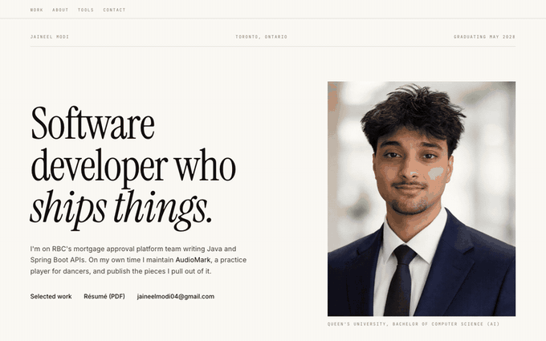

<div align="center">

# Jaineel Modi, Portfolio

**Personal site at [jaineelmodi.com](https://jaineelmodi.com)**

[](https://github.com/jaineelmodi11/jaineel-Portfolio/actions/workflows/deploy.yml)


</div>

<p align="center">
  <a href="https://jaineelmodi.com">
    
  </a>
</p>

---

## 📖 About

A print-inspired portfolio: cream stock, Instrument Serif set large, and the
work laid out as a numbered index rather than a grid of cards. Every page is
static HTML with no client components, so there is no JavaScript framework
running once it loads.

## 🧰 Stack

| | |
| :--- | :--- |
| Framework | Next.js 16, App Router, static export |
| Language | TypeScript |
| Styling | Tailwind CSS 4 |
| Type | Instrument Serif, Inter, JetBrains Mono |
| Hosting | GitHub Pages, deployed on push to `main` |

## 🚀 Development

```bash
npm install
npm run dev
```

Then open [localhost:3000](http://localhost:3000).

```bash
npm run build
```

Writes the static export that GitHub Pages serves.

## 📁 Layout

```
src/
├── app/            layout, page, global styles
├── components/
│   ├── layout/     section nav
│   ├── sections/   hero, work, about, tools, contact
│   └── ui/         icons
└── data/           projects, experience, skills
```

Content lives in `src/data`, so updating a project or a role means editing one
object rather than touching a component.

## 📄 License

The code is free to read and learn from. The writing, photograph and design are
mine, so please do not redeploy this as your own portfolio.
